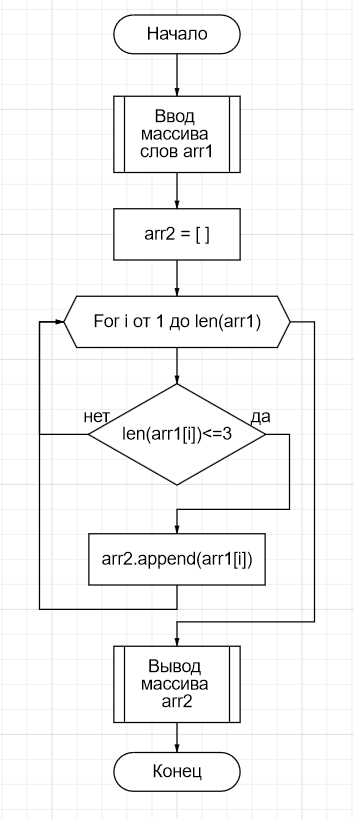

# MySelectSpecRepo

## Задание
Написать программу, которая из имеющегося массива строк формирует массив строк, длина которых меньше либо равна 3 символа.
Первоначальный массив можно ввести с клавиатуры, либо задать на старте выполнения программы.
При решении не рекомендуется пользоваться коллекциями, лучше обойтись исключительно массивами.

## Схема алгоритма

Схема алгоритма для сайта https://programforyou.ru/block-diagram-redactor &ndash; в файле `alg.json`.

## Программа на языке C#
Текст программы &ndash; в файле `Program.cs`.
